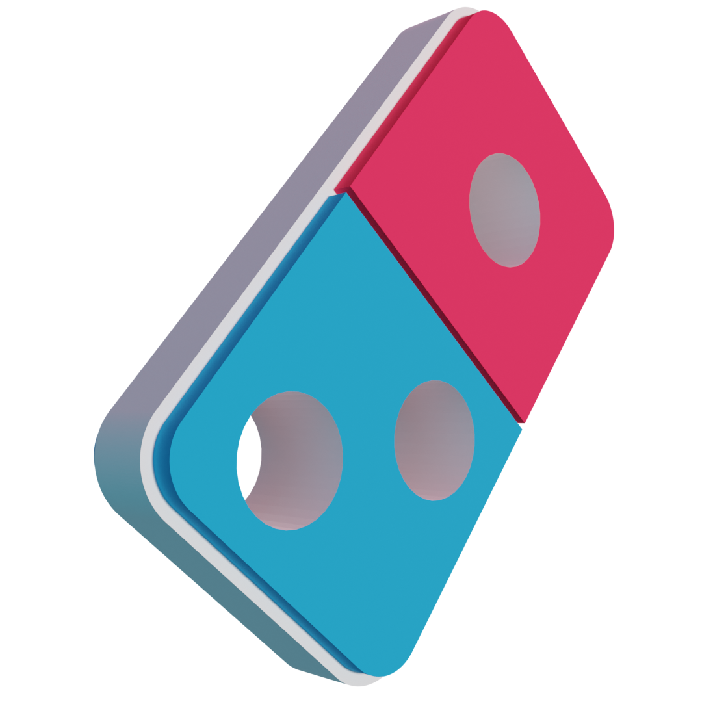

<p align="center">
    
</p>
<h1 align="center">
  Domino's Pizza Redesign App
</h1>

## 🧾 Requirements

1.  **Xampp** >= 8.1.2
2.  **Composer** >= 2.2.6
3.  **NodeJS** >= 17.5.0
4.  **npm** >= 8.4.1

## 🔱 Reference

-   [Figma Design File](https://www.figma.com/file/YfJdoFida9cy8DoIhMDbLh/Domino-s-Redesign-File)

## 🚀 Quick start

1. **Create Database**
   Create database with name `dominos`.

    > **Note**: If you have custom database name, do not forget to change database name in .env file.

2. **Install depedencies**

    Navigate into your new site’s directory and start it up.

    ```shell
    cd dominos
    npm install
    composer install
    ```

3. **Start developing.**

    ```shell
    php artisan serve
    ```

4. **Open the code and start customizing!**

    Your site is now running at http://localhost:8000 !

    Login with:

    - email: admin@dominos.app
    - password: password

5. **Change the browser breakpoint**

    > **Note**: This website isn't responsive.

    for better experience change the browser breakpoint with this steps:

    1. **inspect** the website,
    2. toggle the **device emulation** by click **Ctrl+Shift+M**, or click on the top left of devtools,
    3. on the top of website, **change the breakpoint** to **393 x 786** or Pixel 3 XL

    Due to time constraints, we did not add responsive features to this website

6. **Learn more**

    - [Laravel Documentation](https://laravel.com/docs)
    - [Simple, fast routing engine](https://laravel.com/docs/routing).
    - [Powerful dependency injection container](https://laravel.com/docs/container).
    - Multiple back-ends for [session](https://laravel.com/docs/session) and [cache](https://laravel.com/docs/cache) storage.
    - Database agnostic [schema migrations](https://laravel.com/docs/migrations).
    - [Laracasts](https://laracasts.com)
